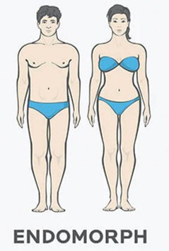

    

<h3 align="center">🏋️‍♂️ Assistente de Personal Trainer - Gerador de Treino Ideal</h3>

Este projeto foi desenvolvido por Rafael Gonçalves como um desafio de engenharia de prompts, onde o objetivo é criar um assistente de personal trainer automatizado que gera treinos personalizados com base em fatores como biotipo corporal, disponibilidade de tempo e tipos de exercícios preferidos. O assistente personaliza os treinos conforme as características e necessidades individuais do usuário, utilizando as melhores práticas de engenharia de prompts.

## 📋 Índice

- [📝 Introdução](#-introdução)
- [💪 Biotipos Corporais](#-biotipos-corporais)
- [📅 Dias Disponíveis para Treino](#-dias-disponíveis-para-treino)
- [🏋️ Tipos de Exercícios](#️-tipos-de-exercícios)
- [🛠️ Regras de Negócio](#️-regras-de-negócio)
- [📖 Material de Apoio](#-material-de-apoio)
- [🎯 Prompt de Resposta Proposto](#-prompt-de-resposta-proposto)

---

## 📝 Introdução

O projeto tem como objetivo criar um assistente de personal trainer automatizado que gera planos de treino personalizados. O usuário informa seu biotipo corporal, a quantidade de dias disponíveis para treino e o tipo de exercício preferido, e o assistente gera um plano de treino ideal com base nessas informações.

---

## 💪 Biotipos Corporais

Para personalizar o treino, o primeiro passo é identificar o biotipo corporal do usuário. Existem três biotipos principais:

| **Imagem**                                                    | **Biotipo**    | **Descrição**                                                        |
|---------------------------------------------------------------|---------------|----------------------------------------------------------------------|
|  | **Ectomorfo** | Corpo magro, dificuldade para ganhar peso e massa muscular.          |
|  | **Mesomorfo** | Corpo naturalmente musculoso, facilidade para ganhar massa muscular. |
|   | **Endomorfo** | Tendência a acumular gordura, dificuldade em perder peso.            |

> **Nota:** Selecione o biotipo que mais se aproxima do seu corpo atual para maximizar a eficiência do treino.

---

## 📅 Dias Disponíveis para Treino

O próximo passo é definir quantos dias por semana o usuário pode treinar. O plano de treino sugerido varia conforme o número de dias disponíveis:

| **Imagem**                                                     | **Dias por Semana** | **Tipo de Treino Sugerido** |
| -------------------------------------------------------------- | ------------------- | --------------------------- |
|  | 1 dia               | Treino Full Body            |
|  | 3 dias              | Treino ABC                  |
|  | 5 dias              | Treino ABCDE                |

- **Full Body**: Treino que envolve o corpo todo em uma única sessão.
- **ABC**: Treino dividido em três dias, cada um focado em grupos musculares diferentes.
- **ABCDE**: Treino dividido em cinco dias, com foco ainda mais específico em cada grupo muscular.

---

## 🏋️ Tipos de Exercícios

A escolha do tipo de exercício preferido é essencial para personalizar ainda mais o plano de treino. Aqui estão algumas categorias com exemplos:

| **Imagem**                                                       | **Tipo de Treino** | **Descrição**                                                                                                 |
| ---------------------------------------------------------------- | ------------------ | ------------------------------------------------------------------------------------------------------------- |
|  | **Funcional**      | Exercícios que melhoram a funcionalidade do corpo, utilizando movimentos naturais.                             |
|   | **Maquinário**     | Exercícios realizados em máquinas, com foco em isolar grupos musculares.                                       |
|      | **Peso Livre**     | Exercícios com pesos livres, como halteres e barras, que trabalham vários grupos musculares simultaneamente.   |
|    | **Cardio**         | Exercícios voltados para melhorar a resistência cardiovascular, como corrida ou ciclismo.                     |
|      | **HIIT**           | Treinos intervalados de alta intensidade, ideais para queima de gordura e aumento da resistência.             |

---

## 🛠️ Regras de Negócio

1. **Identifique seu biotipo corporal** conforme a seção de biotipos.
2. **Determine quantos dias por semana você pode treinar** e escolha o tipo de treino mais adequado.
3. **Selecione o tipo de exercício** que você prefere realizar e que se encaixa melhor nos seus objetivos.
4. Use o prompt do assistente para gerar um plano de treino personalizado.

---

## 📖 Material de Apoio

Aqui estão alguns recursos adicionais para entender melhor o projeto e as práticas de engenharia de prompts:

- [Fundamentos de Engenharia de Prompts](https://elidianaandrade.gitbook.io/fundamentos-de-engenharia-de-prompts-com-claude-3)
- [Boas Práticas de Prompt](https://aline-antunes.gitbook.io/otimize-seus-prompts-e-aprenda-mais-usando-ias-1)

---

## 🎯 Prompt de Resposta Proposto

*(Aqui você pode detalhar o prompt exato que deve ser utilizado no projeto para gerar o treino ideal.)*
